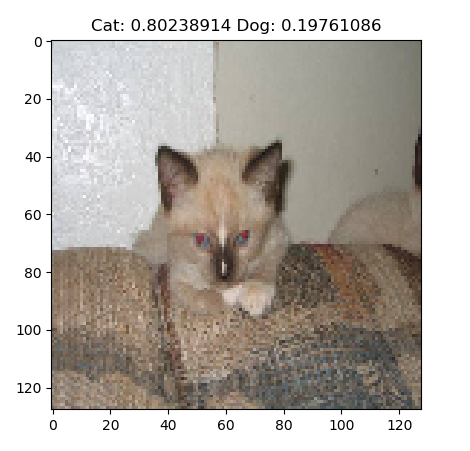

# CatDogAi
A simple ai model using the keras framework that can look at an image and tell wether it is a cat or a dog. This is done using a convolutional neural network. Was able to achieve 99 % accuracy using 128 img_size and 30 epochs. 😺

 
