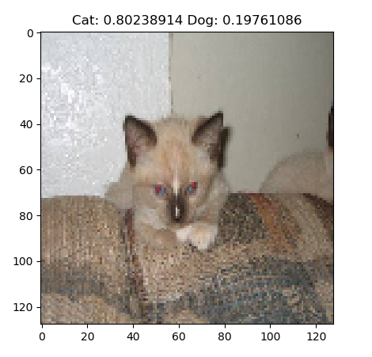

# CatDogAi
A simple ai model using the keras framework that can look at an image and tell wether it is a cat or a dog. This is done using a convolutional neural network. It acheives 87% accuracy in 20 epochs.

 
